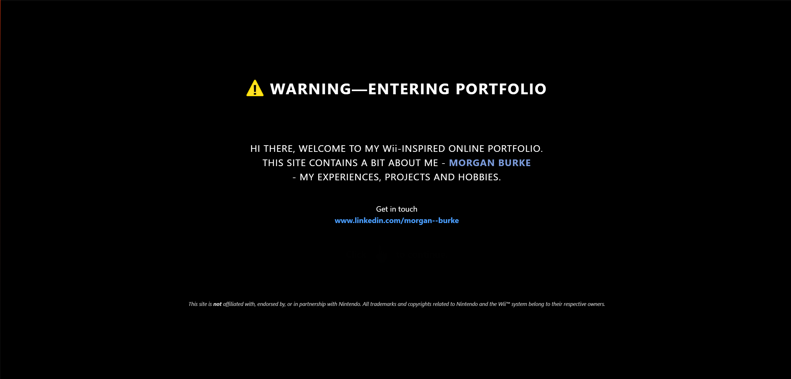
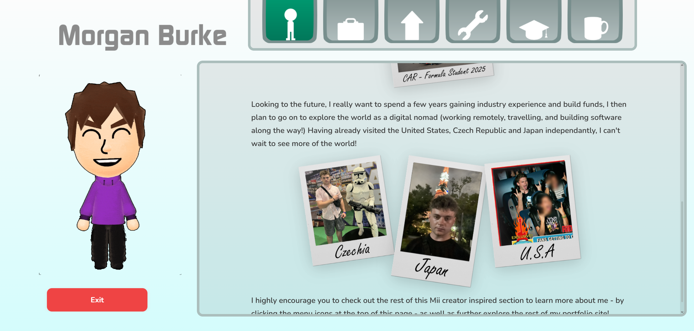
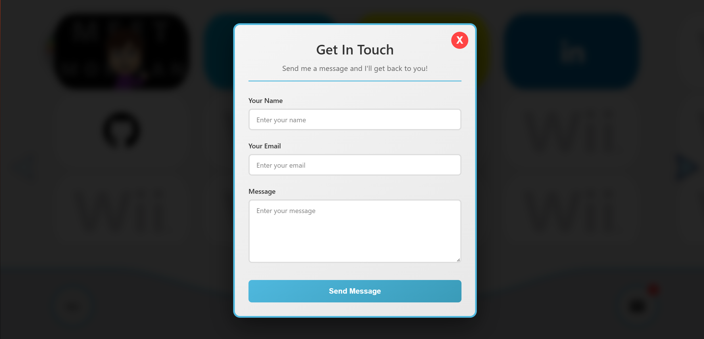

# Morgan Burke's Portfolio

A nostalgic, interactive portfolio website inspired by the Nintendo Wii menu system. Navigate through my projects, experience, and information using a fully recreated Wii interface complete with authentic sounds, animations, and transitions.

**Live Site:** [morganburke.dev](https://morganburke.dev)

---

## Features

### Main Menu (Wii Channel Menu)
- **Authentic Wii Menu Recreation**: Navigate through channels just like the original Wii console
- **Multi-page Grid Layout**: Browse through multiple pages of channel cards
- **Interactive Menu Cards**: Hover effects and smooth animations
- **Real-time Clock & Date**: Live updating time and date display in the footer
- **Custom Cursor**: Wii-style pointer cursor throughout the experience
- **Background Music**: Looping Wii menu music with startup sound sequence

### Channels

#### About Me (Mii Channel Style)
- **Mii Channel Interface**: Recreated Mii Channel experience
- **Interactive Navigation**: Browse through different sections:
  - About Me
  - Work Experience
  - Skills
  - Tools
  - Education
  - Hobbies
- **Rich Media Content**: Photos, polaroids, and visual storytelling
- **Mii Channel Music**: Authentic background audio

#### My Projects (Wii Sports Resort Style)
- **Wii Sports Resort Theme**: Beautiful resort-style interface
- **Project Gallery**: Grid layout showcasing portfolio projects
- **Filter System**: Filter projects by tags (personal, academic, etc.)
- **Project Details Panel**: Slide-out panel with detailed project information
- **Featured Projects**: 
  - NFL Superfan mobile app
  - Wii Themed Portfolio Site (this project!)
- **Background Music**: Wii Sports Resort soundtrack

#### Resume and CV
- **PDF Viewer**: View and download resume/CV
- **Professional Presentation**: Clean, accessible format

#### External Links
- **LinkedIn Integration**: Direct link to LinkedIn profile
- **GitHub Integration**: Direct link to GitHub repositories

### Interactive Features

- **Welcome Screen**: Wii startup warning screen with animation
- **Intermission Overlays**: Transition screens between channels (like loading screens)
- **Pause Menu**: Right-click anywhere to open pause overlay (press Escape to close)
- **Contact Form**: Email integration via EmailJS
- **Smooth Animations**: Framer Motion powered transitions throughout
- **Audio Feedback**: Click sounds and contextual music for each section
- **Responsive Design**: Optimized for desktop and tablet experiences

---

## Tech Stack

- **React 19.2.1** - UI framework
- **Vite 5.0.0** - Build tool and dev server
- **Framer Motion 12.23.25** - Animation library
- **React Router DOM 7.10.1** - Client-side routing
- **EmailJS** - Contact form email service
- **CSS3** - Custom styling with Wii-inspired design

---
## Usage

### Navigation
- **Click** on channel cards to open them
- **Right-click** anywhere to open the pause menu
- **Press Escape** to close the pause menu
- Use **arrow buttons** to navigate between menu pages
- Click the **Exit** button or press **B** (in some sections) to return to the main menu

### Channels
- **About Me**: Click through different sections using the navigation buttons
- **My Projects**: Click on project cards to view details, use filters to narrow down projects
- **Resume and CV**: View and download the PDF
- **LinkedIn/GitHub**: Opens in a new tab

### Contact
- Click the **email icon** in the footer to open the contact form
- Fill out the form and submit to send an email
--- 
## Screenshots

### Welcome Screen

*The initial welcome/warning screen that appears on first load*

### Main Menu

*The main Wii channel menu with navigation cards*

### Game Select Screen

*The game/channel selection screen with full-size preview*

### About Me Channel

*The Mii Channel-style About Me section*

### Projects Page

*The Wii Sports Resort-themed projects gallery*

### Pause Menu

*The pause overlay accessible via right-click*

### Contact Form

*The contact form modal*

---

## Key Features in Detail

### Audio System
- **Startup Sound**: Plays when the site first loads
- **Menu Music**: Loops continuously on the main menu
- **Contextual Music**: Different tracks for different sections (Mii Channel, Wii Sports Resort)
- **Click Sounds**: Audio feedback for user interactions
- **Smart Audio Management**: Music pauses when navigating to channels, resumes when returning

### Animation System
- **Page Transitions**: Smooth fade and slide animations
- **Card Animations**: Staggered entrance animations for menu cards
- **Hover Effects**: Scale and glow effects on interactive elements
- **Intermission Screens**: Loading-style transitions between major sections

### Responsive Design
- **Desktop Optimized**: Best experience on desktop/tablet
- **Touch Support**: Works with touch devices
- **Adaptive Layout**: Adjusts to different screen sizes

---

## Future Enhancements

- Additional project showcases
- Further Styling to match the Wii System
- Interactive mini-games or experiences
- Blog section
- Dark/light mode toggle
- Accessibility improvements
- Performance optimizations
- User Settings

---

## Author

**Morgan Burke**
- Portfolio: [morganburke.dev](https://morganburke.dev)
- LinkedIn: [morgan--burke](https://www.linkedin.com/in/morgan--burke/)
- GitHub: [@LemuelBurke](https://github.com/LemuelBurke)

---

## Acknowledgments

- Nintendo for creating the original Wii console and its iconic interface
- All the nostalgic memories that inspired this project

---

## Contact

Feel free to reach out through:
- The contact form on the website
- LinkedIn: [morgan--burke](https://www.linkedin.com/in/morgan--burke/)

---

**Note**: This portfolio is a personal project created for showcasing my work and skills. The Wii theme is used for nostalgic and creative purposes, paying homage to a beloved gaming console. In no way is the site endorsed, acknowledge or in collaboration with Nintendo. All rights remain with their respective owners.
